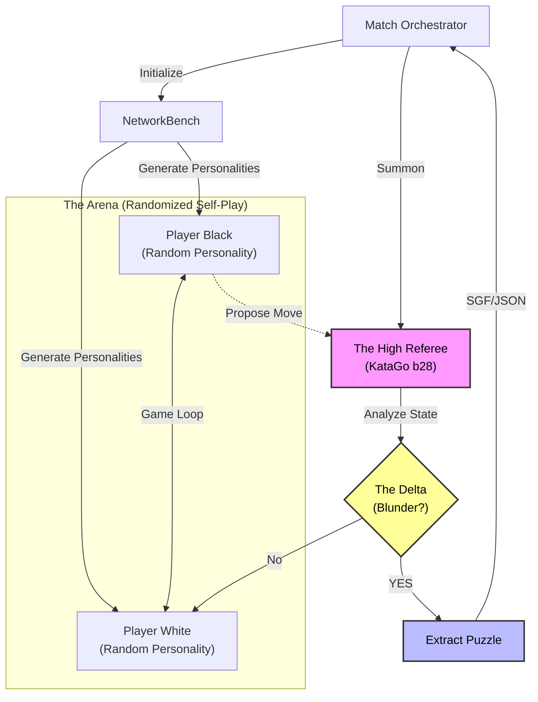

# Infinite AI Tsumego Miner

> **"We do not build the puzzles; we mine them from the chaos of high-temperature logic."**

The **Infinite AI Tsumego Miner** is an autonomous "mining rig" that uses adversarial AI self-play to generate high-quality Go (Weiqi/Baduk) puzzles.

Instead of randomly placing stones, it orchestrates an **Arena** where superhuman Neural Networks play "drunkenly" (high temperature) against each other. When one agent blunders—turning a winning game into a losing one—the system freezes time, analyzes the state with a stricter **Referee** engine, and extracts a Tsumego puzzle where the goal is to punish that specific mistake.

## 🌟 Key Features

*   **The Arena:** Automates matchmaking between 11+ distinct neural network "personalities" (e.g., *The Chameleon* vs *The Titan*).
*   **Personality Profiles:** Every match features randomized **Temperature** (0.8-1.5) and **Visits** (20-300) settings, ensuring no two games are ever alike.
*   **The Delta:** Puzzles are detected by a drop in winrate (e.g., 99% → 10%) as judged by the unrelated **High Referee** network.
*   **Rich Metadata:** Puzzles include SGF SGFs, policy distributions, wrong-move refutations, and detailed difficulty metrics.
*   **Headless Autonomy:** Designed to run indefinitely, mining thousands of puzzles per day on a consumer GPU.

## 🏛️ System Architecture



## 🛠️ Prerequisites

*   **OS:** Windows 10/11 (Primary) or Linux.
*   **Hardware:** NVIDIA GPU (RTX 3060 or better recommended). *Developed on RTX 4070.*
*   **Software:** Python 3.11+.
*   **Dependencies:** `numpy`

## 📂 Installation

1.  **Clone the Repository**
    ```bash
    git clone https://github.com/MachineKomi/Infinite_AI_Tsumego_Miner.git
    cd Infinite_AI_Tsumego_Miner
    ```

2.  **Install Python Dependencies**
    ```bash
    pip install -r requirements.txt
    ```

3.  **Asset Setup (Required)**
    This miner requires specific KataGo binaries and model files.
    *   **KataGo:** Put the Windows OpenCL binary in `assets/katago/`.
    *   **Models:** Download the required neural networks and place them in `assets/models/`.
    
    > 📄 **See `assets/models/README.md` for the exact list of required files and download links.**

## 🚀 Usage

To start the mining session:

```bash
python src/miner.py
```

### CLI Options

| Command | Description |
|---------|-------------|
| `python src/miner.py --dry-run` | Test connectivity to engines without playing games. |
| `python src/miner.py --debug` | Enable verbose logging for debugging. |
| `python src/miner.py --log-file mining.log` | output logs to a file. |

## 📚 Documentation

For deep dives into the architecture and philosophy:

*   **[AGENTS.MD](AGENTS.MD):** The "Source of Truth" for AI agents, including the Model Registry and Personality Profiles.
*   **[assets/models/README.md](assets/models/README.md):** Detailed list of supported networks and their roles.

## ⚖️ License

This project is licensed under the **GNU Affero General Public License v3 (AGPLv3)**.
See [LICENSE](LICENSE) for details.

-----

*Copyright (C) 2025*