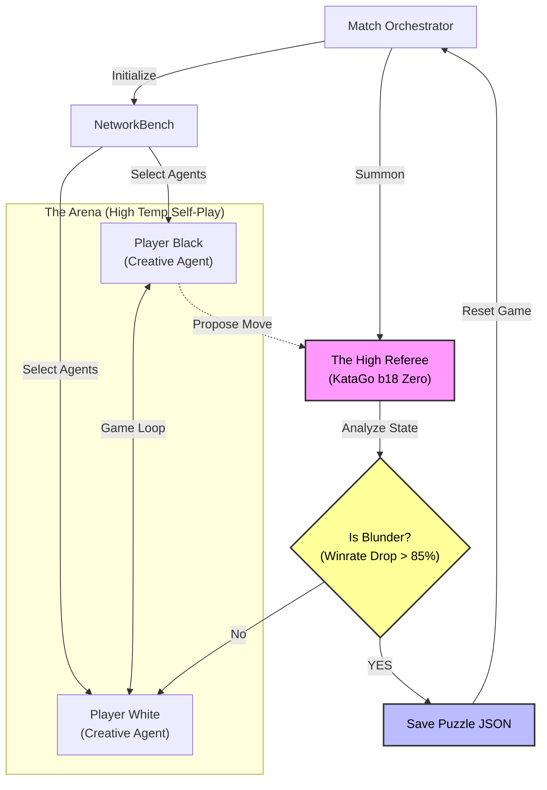

# Infinite AI Tsumego Miner

> **"We do not build the puzzles; we mine them from the chaos of high-temperature logic."**

The **Infinite AI Tsumego Miner** is an autonomous "mining rig" that uses adversarial AI self-play to generate high-quality Go (Weiqi/Baduk) puzzles. 

Instead of randomly placing stones, it forces superhuman Neural Networks to play "drunkenly" (high temperature). When one agent blunders—turning a winning game into a losing one—the system freezes time, analyzes the state with a stricter "Referee" engine, and extracts a Tsumego puzzle where the goal is to punish that specific mistake.

## 🌟 Key Features

* **Adversarial Generation:** Puzzles are derived from "natural" game shapes, not random noise.
* **Dual-Engine Architecture:**
    * **The Players:** High-temperature, creative, fast agents (simulating intuition).
    * **The Referee:** Zero-temperature, high-playout agent (simulating deep calculation) for absolute truth.
* **NetworkBench™:** Orchestrates matches between different "personalities" (e.g., *The Chameleon* (Human-SL) vs *The Veteran* (g170)) to maximize tactical variety.
* **Rich Metadata:** Outputs JSON containing solution trees, difficulty grading (policy vs visits), and territory ownership maps.
* **Headless Autonomy:** Designed to run indefinitely on a GPU server.

### 🏛️ System Architecture



## 🛠️ Prerequisites

* **OS:** Linux (Recommended) or Windows (WSL2).
* **Hardware:** NVIDIA GPU (RTX 3060 or better recommended). *Developed on RTX 4070.*
* **Software:** Python 3.8+
* **Dependencies:** `numpy`

## 📂 Installation & Setup

1.  **Clone the Repository**
    ```bash
    git clone https://github.com/yourusername/Infinite_AI_Tsumego_Miner.git
    cd Infinite_AI_Tsumego_Miner
    ```

2.  **Install Python Dependencies**
    ```bash
    pip install -r requirements.txt
    ```

3.  **Asset Setup (Crucial)**
    You must download the KataGo binary and specific neural network models manually. Place them in the `assets/` directory structure as shown below:

    ```text
    infinite-tsumego-miner/
    ├── assets/
    │   ├── katago/
    │   │   └── katago            # The executable binary (v1.15.0+)
    │   └── models/
    │       ├── referee.bin.gz    # Latest Strongest Model (b18)
    │       ├── human.bin.gz      # Human-SL Model (b18c384nbt-humanv0)
    │       └── vintage.bin.gz    # (Optional) Old g170 15-block model
    ```

    * **KataGo Binary:** [Download Releases](https://github.com/lightvector/KataGo/releases)
    * **Referee Model:** [KataGo Training](https://katagotraining.org/) (Get the latest b18)
    * **Human Model:** [Extra Networks](https://github.com/lightvector/KataGo/blob/master/docs/SupportedModels.md) (Look for `humanv0`)
    * **Vintage Model:** [Training Archives](https://katagotraining.org/networks/) (Scroll down to `g170` run)

## 🚀 Usage

To start the mining session:

```bash
python src/miner.py
````

The system will:

1.  Initialize the **NetworkBench** (load models).
2.  Summon the **High Referee**.
3.  Begin continuous 9x9 self-play matches.
4.  Detect blunders (Winrate drop \> 85%).
5.  Save valid puzzles to the `output/` directory.

### Output Format

Puzzles are saved as rich JSON files:

```json
{
  "uuid": "puzzle_8f2a1c",
  "puzzle_type": "life_and_death_blunder",
  "generated_by": "The_Chameleon",
  "solution": {
    "correct_move": "C3",
    "difficulty_metrics": {
       "visits_to_solve": 450,
       "policy_prior": 0.02
    }
  }
}
```

## 📚 Documentation

For deep dives into the architecture and philosophy:

  * **[AGENTS.md](AGENTS.md):** The "Source of Truth" for AI agents working in this repo.
  * **[Implementation_Plan.md](Implementation_Plan.MD):** Technical blueprint and class structure.
  * **[Approach_and_Principles.md](Approach_and_Principles.MD):** The "Blunder Hypothesis" and grading philosophy.

## ⚖️ License

This project is licensed under the **GNU Affero General Public License v3 (AGPLv3)**.
See [LICENSE](LICENSE.MD) for details.

-----

*Copyright (C) 2025*